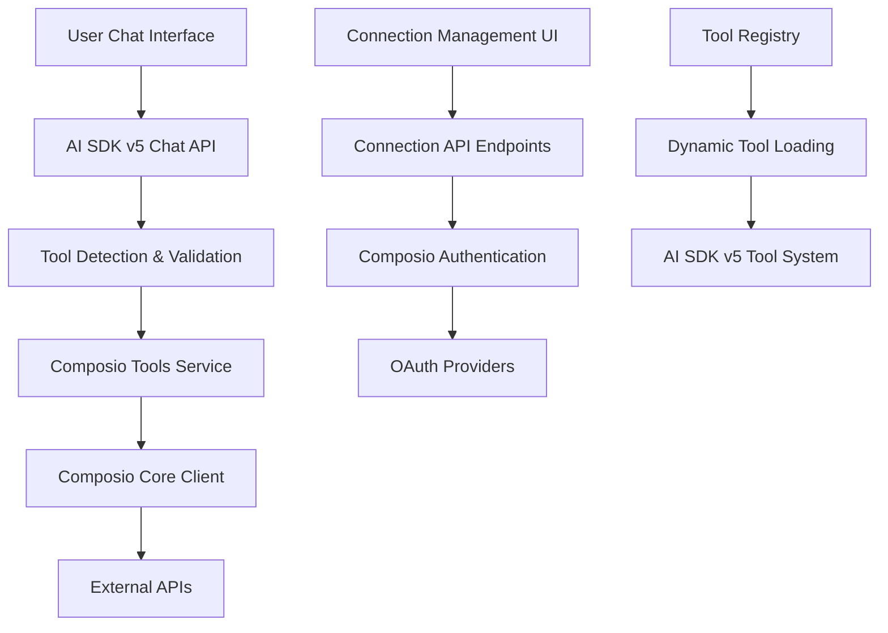
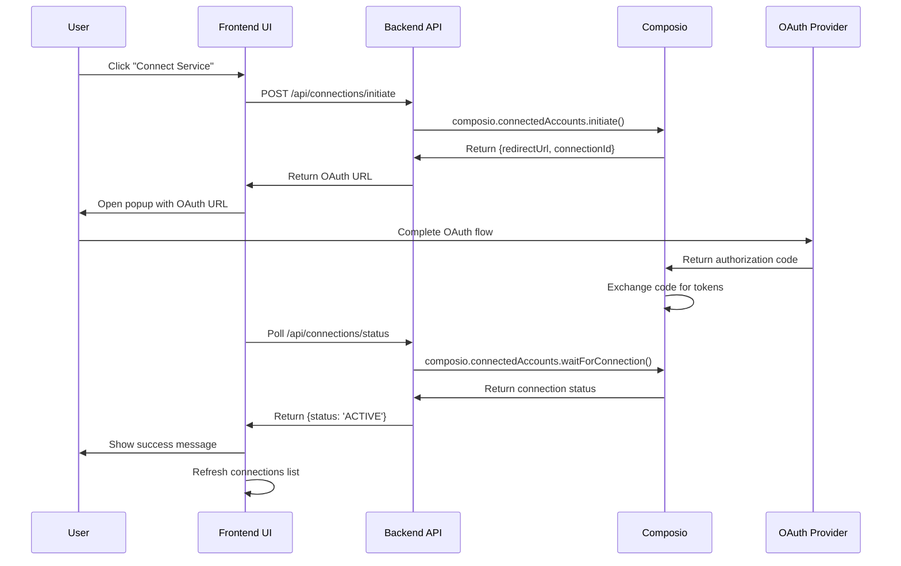

# Composio Integration Guide for AI SDK v5 Application

This comprehensive guide documents how [Composio](https://composio.dev) is integrated with this Next.js 15 AI chatbot application built on the AI SDK v5. Composio provides AI agents with access to 200+ external tools and services through a unified API.

## Table of Contents

1. [Overview](#overview)
2. [Architecture](#architecture)
3. [Installation & Setup](#installation--setup)
4. [Core Integration Files](#core-integration-files)
5. [API Endpoints](#api-endpoints)
6. [Tool Integration](#tool-integration)
7. [UI Components](#ui-components)
8. [Authentication Flow](#authentication-flow)
9. [Usage Examples](#usage-examples)
10. [Configuration](#configuration)
11. [Error Handling](#error-handling)
12. [Best Practices](#best-practices)
13. [Troubleshooting](#troubleshooting)

## Overview

### What is Composio?

Composio is a platform that enables AI agents to interact with external tools and services securely. It provides:

- **200+ Pre-built Integrations**: Gmail, Twitter, Slack, GitHub, Notion, and more
- **Unified API**: Single interface for all integrations
- **OAuth Authentication**: Secure user consent flow
- **Real-time Actions**: Execute actions on behalf of users
- **AI SDK v5 Compatibility**: Native support for Vercel's AI SDK

### Integration Benefits

- **Enhanced AI Capabilities**: Enable AI to perform real-world actions
- **Secure Authorization**: OAuth-based user consent
- **Scalable Architecture**: Modular tool system
- **Type Safety**: Full TypeScript support
- **Real-time Feedback**: Live tool execution status

## Architecture

### High-Level Architecture



### Key Components

1. **Composio Service Layer** (`lib/services/composio.ts`)
2. **Tool Integration** (`lib/ai/tools/composio.ts`)
3. **API Endpoints** (`app/(chat)/api/`)
4. **UI Components** (`components/`)
5. **Authentication Flow** (OAuth-based)

## Installation & Setup

### Dependencies

The integration uses the following Composio packages:

```json
{
  "dependencies": {
    "@composio/core": "0.1.39",
    "@composio/vercel": "0.1.39"
  }
}
```

### Environment Variables

Add the following to your `.env.local`:

```bash
# Composio Configuration
COMPOSIO_API_KEY=your_composio_api_key_here

# OAuth Auth Config IDs (obtained from Composio dashboard)
NEXT_PUBLIC_COMPOSIO_AUTH_GMAIL=your_gmail_auth_config_id
NEXT_PUBLIC_COMPOSIO_AUTH_TWITTER=your_twitter_auth_config_id
NEXT_PUBLIC_COMPOSIO_AUTH_MAILCHIMP=your_mailchimp_auth_config_id
```

### Getting Started

1. **Sign up for Composio**: Create an account at [composio.dev](https://composio.dev)
2. **Get API Key**: Generate an API key from your dashboard
3. **Configure OAuth Apps**: Set up OAuth applications for each service
4. **Set Environment Variables**: Add keys to your `.env.local`

## Core Integration Files

### 1. Composio Service (`lib/services/composio.ts`)

The main service file that initializes the Composio client and provides connection management:

```typescript
import { Composio } from '@composio/core';
import { VercelProvider } from '@composio/vercel';

/**
 * Composio client instance for server-side operations
 * This should only be used in server-side code (API routes, server components)
 * For client-side operations, use the API endpoints in /app/api/
 */
const composio = new Composio({
  apiKey: process.env.COMPOSIO_API_KEY,
  provider: new VercelProvider(),
});

/**
 * Enhanced tool fetching with connection verification
 * Ensures user has active connections before attempting to fetch tools
 */
export async function getConnectedToolkits(userId: string) {
  try {
    const connections = await composio.connectedAccounts.list({
      userIds: [userId],
    });
    const activeConnections = connections.items.filter(
      (conn: any) => conn.status === 'ACTIVE',
    );

    return activeConnections.map((conn: any) => ({
      toolkit: conn.toolkit.slug.toUpperCase(),
      connectionId: conn.id,
      status: conn.status,
    }));
  } catch (error) {
    return [];
  }
}

export default composio;
```

**Key Features:**
- Server-side only client initialization
- Connection verification before tool fetching
- Error handling for failed connections
- Type-safe return objects

### 2. Tool Integration (`lib/ai/tools/composio.ts`)

Handles tool schema validation and AI SDK v5 compatibility:

```typescript
import composio, { getConnectedToolkits } from '@/lib/services/composio';

/**
 * Validates and fixes tool schema to ensure AI SDK v5 compatibility
 * AI SDK v5 requires tools to have inputSchema (not parameters) with proper structure
 */
function validateAndFixToolSchema(tool: any): any {
  // Ensure the tool has the required structure
  if (!tool || typeof tool !== 'object') {
    return null;
  }

  // Convert parameters to inputSchema for AI SDK v5 compatibility
  let processedTool = tool;
  if (tool.parameters && !tool.inputSchema) {
    const { parameters, ...toolWithoutParameters } = tool;
    processedTool = { ...toolWithoutParameters, inputSchema: parameters };
  }

  // Fix missing inputSchema type field
  if (processedTool.inputSchema && !processedTool.inputSchema.type) {
    processedTool = {
      ...processedTool,
      inputSchema: { ...processedTool.inputSchema, type: 'object' },
    };
  }

  // Ensure properties exist
  if (processedTool.inputSchema && !processedTool.inputSchema.properties) {
    processedTool = {
      ...processedTool,
      inputSchema: { ...processedTool.inputSchema, properties: {} },
    };
  }

  // Validate the final structure for AI SDK v5
  const isValid =
    processedTool.description &&
    processedTool.inputSchema &&
    processedTool.inputSchema.type === 'object' &&
    processedTool.inputSchema.properties &&
    typeof processedTool.inputSchema.properties === 'object';

  if (!isValid) {
    return null;
  }

  return processedTool;
}

/**
 * Fetches Composio tools for a user based on their active connections
 * Validates and fixes tool schemas to ensure AI SDK v5 compatibility
 */
export async function getComposioTools(
  userId: string,
  requestedToolkits?: string[],
) {
  try {
    // Get connected toolkits first to avoid unnecessary calls
    const connectedToolkits = await getConnectedToolkits(userId);

    if (connectedToolkits.length === 0) {
      return {};
    }

    // Create mapping of toolkit to connectionId for proper account selection
    const toolkitConnectionMap: Record<string, string> = {};
    connectedToolkits.forEach((tk: any) => {
      toolkitConnectionMap[tk.toolkit] = tk.connectionId;
    });

    const toolkitNames = connectedToolkits.map((tk: any) => tk.toolkit);

    // Get tools from Composio with connection mapping
    const firstConnectionId = connectedToolkits[0]?.connectionId;
    const rawTools = await composio.tools.get(userId, {
      toolkits: toolkitNames,
      ...(firstConnectionId && { connectedAccountId: firstConnectionId }),
    });

    // Validate and fix each tool schema, adding connectionId for proper account selection
    const validatedTools: Record<string, any> = {};

    for (const [toolName, tool] of Object.entries(rawTools)) {
      const validatedTool = validateAndFixToolSchema(tool);
      if (validatedTool) {
        // Extract toolkit name from tool name (e.g., GMAIL_SEND_EMAIL -> GMAIL)
        const toolkitName = toolName.split('_')[0];
        const connectionId = toolkitConnectionMap[toolkitName];

        // Add connectedAccountId to tool for proper account selection
        if (connectionId) {
          validatedTool.connectedAccountId = connectionId;
          console.log(`🔗 [${toolName}] Connected to account: ${connectionId}`);
        } else {
          console.warn(
            `⚠️ [${toolName}] No connection ID found for toolkit: ${toolkitName}`,
          );
        }

        validatedTools[toolName] = validatedTool;
      }
    }

    const toolCount = Object.keys(validatedTools).length;
    console.log(
      `📦 [Composio] Successfully prepared ${toolCount} tools for AI SDK`,
    );

    return validatedTools;
  } catch (error) {
    console.error('❌ [Composio] Failed to fetch tools:', error);
    return {};
  }
}
```

**Key Features:**
- AI SDK v5 schema validation and conversion
- Connection-aware tool fetching
- Proper account ID mapping for multi-account scenarios
- Comprehensive error handling and logging

## API Endpoints

### 1. Toolkits API (`/api/toolkits`)

Lists available toolkits with connection status:

```typescript
// GET /api/toolkits
export async function GET() {
  const session = await auth();

  if (!session?.user?.id) {
    return new ChatSDKError("unauthorized:chat").toResponse();
  }

  try {
    // Fetch connected accounts for the user
    const connectedToolkitMap: Map<string, string> = new Map();

    try {
      const connectedAccounts = await composio.connectedAccounts.list({
        userIds: [session.user.id],
      });

      // Extract toolkit slugs and connection IDs from connected accounts
      connectedAccounts.items.forEach((account: ConnectedAccount) => {
        if (account.toolkit?.slug && account.id) {
          connectedToolkitMap.set(
            account.toolkit.slug.toUpperCase(),
            account.id
          );
        }
      });
    } catch (error) {
      console.error("Failed to fetch connected accounts:", error);
    }

    // Fetch all toolkits in parallel
    const toolkitPromises = SUPPORTED_TOOLKITS.map(async (slug) => {
      try {
        const toolkit = (await composio.toolkits.get(slug)) as ToolkitResponse;
        const upperSlug = slug.toUpperCase();
        const connectionId = connectedToolkitMap.get(upperSlug);

        return {
          name: toolkit.name,
          slug: toolkit.slug,
          description: toolkit.meta?.description,
          logo: toolkit.meta?.logo,
          categories: toolkit.meta?.categories,
          isConnected: !!connectionId,
          connectionId: connectionId || undefined,
        };
      } catch (error) {
        console.error(`Failed to fetch toolkit ${slug}:`, error);
        return null;
      }
    });

    const results = await Promise.all(toolkitPromises);
    const toolkits = results.filter((t) => t !== null);

    return NextResponse.json({ toolkits });
  } catch (error) {
    console.error("Failed to fetch toolkits:", error);
    return NextResponse.json(
      { error: "Failed to fetch toolkits" },
      { status: 500 }
    );
  }
}
```

### 2. Connections API (`/api/connections`)

Manages user connections:

```typescript
// GET /api/connections - List user connections
export async function GET(request: Request) {
  const session = await auth();

  if (!session?.user?.id) {
    return new ChatSDKError("unauthorized:chat").toResponse();
  }

  try {
    const connectedToolkits = await getConnectedToolkits(session.user.id);

    return NextResponse.json({
      connections: connectedToolkits,
      totalConnections: connectedToolkits.length,
    });
  } catch (error) {
    console.error("Failed to fetch connections:", error);
    return NextResponse.json(
      { error: "Failed to fetch connections" },
      { status: 500 }
    );
  }
}

// DELETE /api/connections - Delete a connection
export async function DELETE(request: Request) {
  const session = await auth();

  if (!session?.user?.id) {
    return new ChatSDKError("unauthorized:chat").toResponse();
  }

  const { searchParams } = new URL(request.url);
  const connectionId = searchParams.get("connectionId");

  if (!connectionId) {
    return new ChatSDKError(
      "bad_request:api",
      "Connection ID is required"
    ).toResponse();
  }

  try {
    await composio.connectedAccounts.delete(connectionId);

    return NextResponse.json({
      success: true,
      message: "Connection deleted successfully",
    });
  } catch (error) {
    console.error("Failed to delete connection:", error);
    return NextResponse.json(
      { error: "Failed to delete connection" },
      { status: 500 }
    );
  }
}
```

### 3. Connection Initiate API (`/api/connections/initiate`)

Initiates OAuth connections:

```typescript
// POST /api/connections/initiate
export async function POST(request: Request) {
  const session = await auth();

  if (!session?.user?.id) {
    return new ChatSDKError("unauthorized:chat").toResponse();
  }

  let requestBody: { authConfigId: string };

  try {
    const json = await request.json();
    requestBody = initiateConnectionSchema.parse(json);
  } catch (_) {
    return new ChatSDKError(
      "bad_request:api",
      "Invalid request body"
    ).toResponse();
  }

  try {
    const { authConfigId } = requestBody;

    // Initiate connection with Composio
    const connectionRequest = (await composio.connectedAccounts.initiate(
      session.user.id,
      authConfigId
    )) as ConnectionRequestResponse;

    return NextResponse.json({
      redirectUrl: connectionRequest.redirectUrl,
      connectionId: connectionRequest.id,
    });
  } catch (error) {
    console.error("Failed to initiate connection:", error);
    return NextResponse.json(
      { error: "Failed to initiate connection" },
      { status: 500 }
    );
  }
}
```

### 4. Connection Status API (`/api/connections/status`)

Checks connection completion status:

```typescript
// GET /api/connections/status
export async function GET(request: Request) {
  const session = await auth();

  if (!session?.user?.id) {
    return new ChatSDKError("unauthorized:chat").toResponse();
  }

  const { searchParams } = new URL(request.url);
  const connectionId = searchParams.get("connectionId");

  if (!connectionId) {
    return new ChatSDKError(
      "bad_request:api",
      "Connection ID is required"
    ).toResponse();
  }

  try {
    // Wait for connection to complete (with timeout)
    const connection = (await composio.connectedAccounts.waitForConnection(
      connectionId
    )) as ConnectionStatus;

    return NextResponse.json({
      id: connection.id,
      status: connection.status,
      authConfig: connection.authConfig,
      data: connection.data,
      params: connection.params,
    });
  } catch (error) {
    console.error("Failed to get connection status:", error);
    return NextResponse.json(
      { error: "Failed to get connection status" },
      { status: 500 }
    );
  }
}
```

## Tool Integration

### Chat API Integration

The main chat API (`/api/chat`) integrates Composio tools:

```typescript
// In /api/chat/route.ts
import { getComposioTools } from '@/lib/ai/tools/composio';

export async function POST(request: Request) {
  // ... authentication and validation ...

  try {
    // Fetch user's connected toolkits and Composio tools
    let composioTools = {};
    try {
      console.log(`🔄 Loading Composio tools for user: ${session.user.id}`);
      composioTools = await getComposioTools(session.user.id);
      const toolNames = Object.keys(composioTools);
    } catch (error) {
      console.error('❌ Failed to load Composio tools:', error);
      // Continue without Composio tools if this fails
    }

    // Combine all tools (internal + Composio)
    const allTools = {
      createDocument,
      updateDocument,
      requestSuggestions,
      getWeather,
      ...composioTools, // Dynamic tools from Composio
    };

    const result = await streamText({
      model: myProvider(selectedChatModel, {
        structuredOutputs: true,
      }),
      system: systemPrompt(requestHints),
      messages,
      maxSteps: 5,
      tools: allTools, // Pass combined tools to AI SDK
      onStepFinish: async ({ stepType, toolCalls, toolResults }) => {
        // Handle tool execution logging
        if (stepType === 'tool-call' && toolCalls?.length > 0) {
          const toolCallsWithTimestamp = toolCalls.map((toolCall) => ({
            ...toolCall,
            timestamp: new Date(),
          }));
          console.log('🔧 Tool calls executed:', toolCallsWithTimestamp);
        }
      },
    });

    return result.toDataStreamResponse();
  } catch (error) {
    console.error('Chat API error:', error);
    return new ChatSDKError('internal_server_error:api').toResponse();
  }
}
```

**Key Integration Points:**
- Dynamic tool loading based on user connections
- Fallback behavior when tools fail to load
- Tool execution logging and monitoring
- AI SDK v5 compatibility

## UI Components

### 1. Composio Tool Component (`components/composio-tool.tsx`)

Displays tool execution status in the chat interface:

```typescript
'use client';

import {
  AITool,
  AIToolHeader,
  AIToolContent,
  AIToolParameters,
  AIToolResult,
  type AIToolStatus,
} from '@/components/ui/kibo-ui/ai/tool';

interface ComposioToolProps {
  toolName: string;
  toolCallId: string;
  state?: 'partial-call' | 'call' | 'result' | 'output-available';
  input?: any;
  output?: any;
}

// Helper function to convert AI SDK state to AITool status
const getToolStatus = (state?: string, hasError?: boolean): AIToolStatus => {
  if (hasError) return 'error';

  switch (state) {
    case 'partial-call':
      return 'pending';
    case 'call':
      return 'running';
    case 'result':
      return 'running';
    case 'output-available':
      return 'completed';
    default:
      return 'pending';
  }
};

// Helper function to format tool name for display
const formatToolName = (toolName: string): string => {
  // Convert GMAIL_SEND_EMAIL to "Gmail Send Email"
  return toolName
    .split('_')
    .map((word) => word.charAt(0).toUpperCase() + word.slice(1).toLowerCase())
    .join(' ');
};

export const ComposioTool = ({
  toolName,
  toolCallId,
  state,
  input,
  output,
}: ComposioToolProps) => {
  const displayName = formatToolName(toolName);
  const description = getToolDescription(toolName);

  // Check if there's an error in the output
  const hasError =
    output &&
    typeof output === 'object' &&
    ('error' in output || 'errorMessage' in output) &&
    !('data' in output || 'success' in output || 'result' in output);
  const status = getToolStatus(state, hasError);

  // Determine if the tool should be open by default
  const shouldOpenByDefault = status === 'completed' || status === 'error';

  return (
    <AITool defaultOpen={shouldOpenByDefault}>
      <AIToolHeader
        status={status}
        name={displayName}
        description={description}
      />
      <AIToolContent>
        {input && Object.keys(input).length > 0 && (
          <AIToolParameters parameters={input} />
        )}

        {state === 'output-available' && output && (
          <AIToolResult
            result={hasError ? undefined : formatOutput(output)}
            error={
              hasError
                ? String(output.error || output.message || 'Unknown error')
                : undefined
            }
          />
        )}

        {(state === 'result' || state === 'call' || state === 'partial-call') &&
          !output && (
            <div className="flex items-center gap-2 text-sm text-muted-foreground p-2 bg-muted/50 rounded">
              <div className="animate-pulse">⏳</div>
              Executing {displayName.toLowerCase()}...
            </div>
          )}
      </AIToolContent>
    </AITool>
  );
};
```

**Features:**
- Real-time status updates
- Error state handling
- User-friendly tool name formatting
- Collapsible tool details
- Parameter and result display

### 2. Toolkit List Component (`components/toolkit-list.tsx`)

Manages available services and connections:

```typescript
'use client';

import { useState, useEffect } from 'react';
import { ConnectionCard } from './connection-card';

interface Toolkit {
  name: string;
  slug: string;
  description?: string;
  logo?: string;
  categories?: Array<{
    name: string;
    slug: string;
  }>;
  isConnected: boolean;
  connectionId?: string;
}

export function ToolkitList({ onConnectionChange }: ToolkitListProps) {
  const [toolkits, setToolkits] = useState<Toolkit[]>([]);
  const [isLoading, setIsLoading] = useState(true);
  const [error, setError] = useState<string | null>(null);

  const fetchToolkits = async () => {
    try {
      setError(null);
      const response = await fetch('/api/toolkits');
      
      if (!response.ok) {
        throw new Error(`Failed to fetch toolkits: ${response.statusText}`);
      }
      
      const data = await response.json();
      setToolkits(data.toolkits || []);
    } catch (error) {
      console.error('Failed to fetch toolkits:', error);
      setError(error instanceof Error ? error.message : 'Failed to load toolkits');
      toast.error('Failed to load available services');
    } finally {
      setIsLoading(false);
    }
  };

  const handleConnect = async (toolkit: Toolkit) => {
    try {
      // Map toolkit slugs to their corresponding auth config IDs
      const authConfigMap: Record<string, string> = {
        gmail: process.env.NEXT_PUBLIC_COMPOSIO_AUTH_GMAIL || '',
        twitter: process.env.NEXT_PUBLIC_COMPOSIO_AUTH_TWITTER || '',
        mailchimp: process.env.NEXT_PUBLIC_COMPOSIO_AUTH_MAILCHIMP || '',
      };

      const authConfigId = authConfigMap[toolkit.slug];
      
      if (!authConfigId) {
        toast.error(`No auth configuration found for ${toolkit.name}.`);
        return;
      }

      // Initiate the connection
      const response = await fetch('/api/connections/initiate', {
        method: 'POST',
        headers: {
          'Content-Type': 'application/json',
        },
        body: JSON.stringify({
          authConfigId,
        }),
      });

      if (!response.ok) {
        throw new Error(`Failed to initiate connection: ${response.statusText}`);
      }

      const data = await response.json();
      
      if (data.redirectUrl) {
        // Open the OAuth URL in a new window
        const authWindow = window.open(
          data.redirectUrl,
          'oauth',
          'width=600,height=700,scrollbars=yes,resizable=yes'
        );

        if (!authWindow) {
          toast.error('Please allow popups to complete the connection');
          return;
        }

        // Poll for connection status
        const pollStatus = async () => {
          try {
            const statusResponse = await fetch(
              `/api/connections/status?connectionId=${data.connectionId}`
            );
            
            if (statusResponse.ok) {
              const statusData = await statusResponse.json();
              
              if (statusData.status === 'ACTIVE') {
                authWindow.close();
                toast.success(`Successfully connected to ${toolkit.name}!`);
                await fetchToolkits(); // Refresh the list
                onConnectionChange?.();
                return;
              } else if (statusData.status === 'FAILED' || statusData.status === 'EXPIRED') {
                authWindow.close();
                toast.error(`Failed to connect to ${toolkit.name}`);
                return;
              }
            }
            
            // Continue polling if still in progress
            setTimeout(pollStatus, 2000);
          } catch (error) {
            console.error('Error polling connection status:', error);
            setTimeout(pollStatus, 2000);
          }
        };

        // Start polling after a short delay
        setTimeout(pollStatus, 2000);
      }
    } catch (error) {
      console.error('Failed to connect:', error);
      toast.error(`Failed to connect to ${toolkit.name}`);
    }
  };

  // ... rest of component implementation
}
```

**Features:**
- Lists available and connected services
- OAuth popup flow management
- Connection status polling
- Real-time UI updates
- Error handling and user feedback

## Authentication Flow

### OAuth Integration Flow



### Implementation Details

1. **Initiation**: User clicks connect, frontend calls initiate API
2. **OAuth Popup**: Frontend opens popup with OAuth URL
3. **User Authorization**: User completes OAuth flow in popup
4. **Status Polling**: Frontend polls status API every 2 seconds
5. **Completion**: When status becomes 'ACTIVE', close popup and refresh
6. **Error Handling**: Handle 'FAILED' or 'EXPIRED' statuses appropriately

## Usage Examples

### 1. Basic Tool Usage in Chat

```typescript
// User message: "Send an email to john@example.com about the meeting"

// AI SDK will automatically:
// 1. Detect GMAIL_SEND_EMAIL tool is available
// 2. Extract parameters from user message
// 3. Call the tool with proper parameters
// 4. Display results in chat interface

const toolCall = {
  toolName: 'GMAIL_SEND_EMAIL',
  parameters: {
    to: 'john@example.com',
    subject: 'Meeting Discussion',
    body: 'Hi John, I wanted to follow up on our meeting...'
  }
};
```

### 2. Connection Management

```typescript
// Check user connections
const response = await fetch('/api/connections');
const { connections } = await response.json();

console.log('User has', connections.length, 'active connections');

// Connect new service
const connectResponse = await fetch('/api/connections/initiate', {
  method: 'POST',
  body: JSON.stringify({
    authConfigId: 'gmail_auth_config_id'
  })
});

const { redirectUrl } = await connectResponse.json();
// Open redirectUrl in popup for OAuth flow
```

### 3. Custom Tool Implementation

```typescript
// Extending with custom Composio tools
export async function getCustomComposioTools(userId: string) {
  const tools = await getComposioTools(userId);
  
  // Add custom wrapper or modifications
  const customTools = Object.entries(tools).reduce((acc, [name, tool]) => {
    acc[name] = {
      ...tool,
      // Add custom logging or validation
      execute: async (params: any) => {
        console.log(`Executing ${name} with params:`, params);
        return await tool.execute(params);
      }
    };
    return acc;
  }, {} as Record<string, any>);
  
  return customTools;
}
```

## Configuration

### Supported Toolkits

Currently supported toolkits (defined in `/api/toolkits/route.ts`):

```typescript
const SUPPORTED_TOOLKITS = [
  "GMAIL",     // Email management
  "TWITTER",   // Social media posting
  "MAILCHIMP", // Email marketing
];
```

### Adding New Toolkits

1. **Add to Supported List**:
```typescript
const SUPPORTED_TOOLKITS = [
  "GMAIL",
  "TWITTER", 
  "MAILCHIMP",
  "SLACK",     // New toolkit
];
```

2. **Add Auth Config**:
```bash
# Add to .env.local
NEXT_PUBLIC_COMPOSIO_AUTH_SLACK=your_slack_auth_config_id
```

3. **Update Auth Config Map**:
```typescript
const authConfigMap: Record<string, string> = {
  gmail: process.env.NEXT_PUBLIC_COMPOSIO_AUTH_GMAIL || '',
  twitter: process.env.NEXT_PUBLIC_COMPOSIO_AUTH_TWITTER || '',
  mailchimp: process.env.NEXT_PUBLIC_COMPOSIO_AUTH_MAILCHIMP || '',
  slack: process.env.NEXT_PUBLIC_COMPOSIO_AUTH_SLACK || '', // New
};
```

### Environment Configuration

```bash
# Required: Composio API Key
COMPOSIO_API_KEY=comp_your_api_key_here

# OAuth Auth Config IDs (get from Composio dashboard)
NEXT_PUBLIC_COMPOSIO_AUTH_GMAIL=gmail_auth_config_123
NEXT_PUBLIC_COMPOSIO_AUTH_TWITTER=twitter_auth_config_456
NEXT_PUBLIC_COMPOSIO_AUTH_MAILCHIMP=mailchimp_auth_config_789

# Optional: Composio Base URL (defaults to production)
COMPOSIO_BASE_URL=https://backend.composio.dev

# Optional: Enable debug logging
COMPOSIO_DEBUG=true
```

## Error Handling

### Common Error Scenarios

1. **Missing API Key**:
```typescript
// Error: Composio client initialization fails
// Solution: Ensure COMPOSIO_API_KEY is set
if (!process.env.COMPOSIO_API_KEY) {
  throw new Error('COMPOSIO_API_KEY environment variable is required');
}
```

2. **Invalid Tool Schema**:
```typescript
// Error: Tool doesn't match AI SDK v5 requirements
// Solution: Tool validation automatically fixes schemas
const validatedTool = validateAndFixToolSchema(tool);
if (!validatedTool) {
  console.warn(`Tool ${toolName} failed validation, skipping`);
  continue;
}
```

3. **Connection Failures**:
```typescript
// Error: OAuth connection fails or expires
// Solution: Proper error handling in status polling
if (statusData.status === 'FAILED' || statusData.status === 'EXPIRED') {
  authWindow.close();
  toast.error(`Failed to connect to ${toolkit.name}`);
  return;
}
```

4. **Rate Limiting**:
```typescript
// Error: Too many API calls to Composio
// Solution: Implement retry with exponential backoff
const retryWithBackoff = async (fn: Function, retries = 3) => {
  try {
    return await fn();
  } catch (error) {
    if (retries > 0 && error.status === 429) {
      await new Promise(resolve => setTimeout(resolve, 1000 * (4 - retries)));
      return retryWithBackoff(fn, retries - 1);
    }
    throw error;
  }
};
```

### Error Response Format

```typescript
// Standard error response format
interface ComposioError {
  error: string;
  code?: string;
  details?: any;
}

// Example error responses
{
  "error": "Unauthorized: Invalid API key",
  "code": "INVALID_API_KEY"
}

{
  "error": "Connection not found",
  "code": "CONNECTION_NOT_FOUND",
  "details": { "connectionId": "conn_123" }
}
```

## Best Practices

### 1. Security

- **API Key Protection**: Never expose API keys in client-side code
- **Connection Validation**: Always verify user owns connection before using
- **Input Sanitization**: Validate all user inputs before passing to tools
- **Error Information**: Don't expose sensitive error details to users

```typescript
// Good: Server-side API key usage
const composio = new Composio({
  apiKey: process.env.COMPOSIO_API_KEY, // Server-side only
});

// Bad: Client-side API key exposure
const composio = new Composio({
  apiKey: 'comp_public_key_123', // Never do this
});
```

### 2. Performance

- **Connection Caching**: Cache connection status to avoid repeated API calls
- **Tool Validation**: Pre-validate tools to prevent runtime failures
- **Parallel Loading**: Load multiple toolkits in parallel
- **Error Boundaries**: Implement proper error boundaries for UI components

```typescript
// Good: Parallel toolkit loading
const toolkitPromises = SUPPORTED_TOOLKITS.map(async (slug) => {
  return await composio.toolkits.get(slug);
});
const results = await Promise.all(toolkitPromises);

// Good: Connection caching
const connectedToolkits = await redis.get(`connections:${userId}`) || 
  await getConnectedToolkits(userId);
```

### 3. User Experience

- **Loading States**: Show loading indicators during OAuth flows
- **Error Messages**: Provide clear, actionable error messages
- **Status Updates**: Keep users informed of tool execution progress
- **Graceful Degradation**: Continue working when some tools fail

```typescript
// Good: Clear loading states
{isLoading && (
  <div className="flex items-center gap-2">
    <Loader2 className="size-4 animate-spin" />
    Executing {toolName}...
  </div>
)}

// Good: Actionable error messages
{error && (
  <div className="text-red-600">
    Failed to connect to {serviceName}. 
    <button onClick={retry}>Try Again</button>
  </div>
)}
```

### 4. Development

- **Type Safety**: Use TypeScript for all Composio interactions
- **Logging**: Implement comprehensive logging for debugging
- **Testing**: Test OAuth flows and tool executions
- **Documentation**: Keep integration documentation up to date

```typescript
// Good: Type-safe interfaces
interface ToolkitConnection {
  toolkit: string;
  connectionId: string;
  status: 'ACTIVE' | 'INACTIVE' | 'FAILED';
}

// Good: Comprehensive logging
console.log(`🔗 [${toolName}] Connected to account: ${connectionId}`);
console.warn(`⚠️ [${toolName}] No connection ID found for toolkit: ${toolkitName}`);
console.error('❌ [Composio] Failed to fetch tools:', error);
```

## Troubleshooting

### Common Issues

#### 1. Tools Not Loading

**Symptoms**: No Composio tools available in chat

**Diagnosis**:
```bash
# Check API key
curl -H "X-API-Key: $COMPOSIO_API_KEY" https://backend.composio.dev/api/v1/connectedAccounts

# Check user connections
GET /api/connections
```

**Solutions**:
- Verify `COMPOSIO_API_KEY` is set correctly
- Ensure user has active connections
- Check server logs for authentication errors

#### 2. OAuth Flow Failures

**Symptoms**: Popup closes without connecting

**Diagnosis**:
```javascript
// Monitor connection status
const status = await fetch(`/api/connections/status?connectionId=${id}`);
console.log('Connection status:', await status.json());
```

**Solutions**:
- Verify auth config IDs are correct
- Check OAuth app settings in provider dashboard
- Ensure popup blockers are disabled
- Verify redirect URLs match configuration

#### 3. Tool Execution Errors

**Symptoms**: Tools fail to execute or return errors

**Diagnosis**:
```typescript
// Enable debug logging
const result = await composio.tools.execute({
  toolName: 'GMAIL_SEND_EMAIL',
  parameters: { /* ... */ },
  connectedAccountId: connectionId,
  debug: true, // Enable debug mode
});
```

**Solutions**:
- Verify tool parameters match expected schema
- Check connection permissions and scopes
- Ensure connected account has necessary permissions
- Review tool execution logs

#### 4. Schema Validation Failures

**Symptoms**: Tools not recognized by AI SDK v5

**Diagnosis**:
```typescript
// Check tool schema
const tools = await getComposioTools(userId);
console.log('Tool schemas:', Object.keys(tools).map(key => ({
  name: key,
  hasInputSchema: !!tools[key].inputSchema,
  schemaType: tools[key].inputSchema?.type,
})));
```

**Solutions**:
- Review `validateAndFixToolSchema` function
- Ensure AI SDK v5 compatibility
- Check for missing required schema fields

### Debug Mode

Enable comprehensive debugging:

```bash
# Enable debug logging
COMPOSIO_DEBUG=true
NEXT_PUBLIC_DEBUG=true

# Enable AI SDK debug mode
AI_SDK_DEBUG=true
```

Debug output will show:
- Tool loading and validation steps
- Connection status changes
- API request/response details
- Schema transformation process

### Performance Monitoring

Monitor integration performance:

```typescript
// Add performance timing
const startTime = Date.now();
const tools = await getComposioTools(userId);
const loadTime = Date.now() - startTime;

console.log(`🚀 Loaded ${Object.keys(tools).length} tools in ${loadTime}ms`);

// Monitor tool execution times
const executionStart = Date.now();
const result = await tool.execute(parameters);
const executionTime = Date.now() - executionStart;

console.log(`⚡ Tool ${toolName} executed in ${executionTime}ms`);
```

### Health Checks

Implement health checks for the integration:

```typescript
// Health check endpoint
export async function GET() {
  try {
    // Test Composio connection
    const healthCheck = await composio.connectedAccounts.list({ limit: 1 });
    
    return NextResponse.json({
      status: 'healthy',
      composio: 'connected',
      timestamp: new Date().toISOString(),
    });
  } catch (error) {
    return NextResponse.json({
      status: 'unhealthy',
      composio: 'disconnected',
      error: error.message,
      timestamp: new Date().toISOString(),
    }, { status: 500 });
  }
}
```

---

## Conclusion

This integration provides a robust foundation for connecting AI agents with external services through Composio. The architecture ensures:

- **Security**: OAuth-based authentication with proper API key management
- **Scalability**: Modular design supporting easy addition of new services
- **Reliability**: Comprehensive error handling and graceful degradation
- **User Experience**: Intuitive connection management and real-time feedback
- **Developer Experience**: Type-safe APIs with comprehensive logging

The integration seamlessly combines Composio's powerful tool ecosystem with AI SDK v5's streaming capabilities, creating a powerful platform for AI-powered automation.

For additional support:
- [Composio Documentation](https://docs.composio.dev)
- [AI SDK v5 Documentation](https://sdk.vercel.ai/docs)
- [GitHub Issues](https://github.com/your-repo/issues)