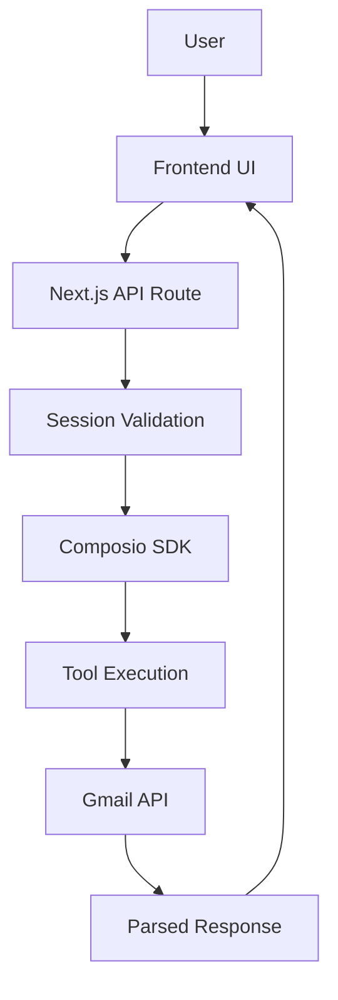

# Composio Manual Tool Execution Guide

## Overview

This document provides comprehensive guidance on manually executing Composio tools on behalf of users within the multitask application. It demonstrates the implementation of server-side tool execution with automatic authentication handling, using Gmail integration as a practical example.

## Table of Contents

1. [What is Manual Tool Execution?](#what-is-manual-tool-execution)
2. [Architecture Overview](#architecture-overview)
3. [Implementation Details](#implementation-details)
4. [API Integration](#api-integration)
5. [Frontend Integration](#frontend-integration)
6. [Authentication & Security](#authentication--security)
7. [Error Handling](#error-handling)
8. [Testing & Debugging](#testing--debugging)
9. [Best Practices](#best-practices)
10. [Troubleshooting](#troubleshooting)
11. [Extension Guide](#extension-guide)

## What is Manual Tool Execution?

Manual tool execution allows developers to programmatically call Composio tools on behalf of authenticated users without requiring LLM integration. This approach is particularly useful for:

- **Direct API Integration**: Execute specific tools in response to user actions
- **Server-Side Processing**: Handle tool execution in secure backend environments
- **Deterministic Workflows**: Create predictable, non-AI-driven tool interactions
- **Custom User Interfaces**: Build tailored UIs for specific tool functionalities

### Key Benefits

- ✅ **Automatic Authentication**: Composio handles OAuth tokens and credentials
- ✅ **Direct Control**: Execute tools without LLM interpretation
- ✅ **Secure Execution**: Server-side processing with session validation
- ✅ **Rich Response Data**: Access to full tool response structures
- ✅ **Error Handling**: Comprehensive error reporting and debugging

## Architecture Overview



### Components

1. **Frontend Component** (`/manual-test/page.tsx`)

   - User interface for triggering tool execution
   - Response display and error handling
   - Loading states and user feedback

2. **API Route** (`/api/manual-test/route.ts`)

   - Server-side tool execution
   - Authentication validation
   - Response processing and formatting

3. **Composio Integration** (`/lib/services/composio.ts`)
   - SDK initialization and configuration
   - Tool execution interface

## Implementation Details

### Core Tool Execution Pattern

The fundamental pattern for manual tool execution follows this structure:

```typescript
const result = await composio.tools.execute("TOOL_SLUG", {
  userId: "user-identifier",
  arguments: {
    // Tool-specific parameters
  },
  // Optional: connected account ID for specific integrations
  connectedAccountId: "account-id",
});
```

### Gmail Integration Example

Our implementation demonstrates this pattern with Gmail integration:

```typescript
// Execute GMAIL_FETCH_EMAILS tool
const result = await composio.tools.execute("GMAIL_FETCH_EMAILS", {
  userId: session.user.id,
  arguments: {
    maxResults: 1,
    query: "in:inbox",
  },
});
```

### Response Structure

Composio tools return a standardized response structure:

```typescript
interface ToolExecuteResponse {
  successful: boolean; // Execution success status
  error: string | null; // Error message if failed
  data: Record<string, unknown>; // Tool-specific response data
  logId?: string; // Debug log identifier
  sessionInfo?: unknown; // Session context
}
```

## API Integration

### API Route Implementation

**File**: `app/(chat)/api/manual-test/route.ts`

```typescript
import { NextResponse } from "next/server";
import { auth } from "@/lib/auth";
import composio from "@/lib/services/composio";
import { ChatSDKError } from "@/lib/errors";

export async function POST() {
  // 1. Authentication Validation
  const session = await auth();
  if (!session?.user?.id) {
    return new ChatSDKError("unauthorized:chat").toResponse();
  }

  try {
    // 2. Tool Execution
    const result = await composio.tools.execute("GMAIL_FETCH_EMAILS", {
      userId: session.user.id,
      arguments: {
        maxResults: 1,
        query: "in:inbox",
      },
    });

    // 3. Response Processing
    const hasMessages =
      result.data &&
      typeof result.data === "object" &&
      "messages" in result.data &&
      Array.isArray((result.data as any).messages);

    if (
      result.successful &&
      hasMessages &&
      (result.data as any).messages.length > 0
    ) {
      const data = result.data as any;
      return NextResponse.json({
        success: true,
        email: data.messages[0],
        allEmails: data.messages,
        emailCount: data.messages.length,
        nextPageToken: data.nextPageToken,
        resultSizeEstimate: data.resultSizeEstimate,
      });
    }

    // 4. Error Response
    return NextResponse.json({
      success: false,
      message: result.error || "No emails found in inbox",
      debug: {
        successful: result.successful,
        error: result.error,
        hasMessages,
        dataStructure: result.data,
      },
    });
  } catch (error) {
    console.error("Gmail fetch error:", error);
    return NextResponse.json(
      {
        success: false,
        error: "Failed to fetch email via Composio execute",
        details: error instanceof Error ? error.message : "Unknown error",
      },
      { status: 500 }
    );
  }
}
```

### Key Implementation Steps

1. **Session Validation**: Verify user authentication before tool execution
2. **Tool Execution**: Call Composio SDK with appropriate parameters
3. **Response Parsing**: Handle tool-specific response structures
4. **Error Handling**: Provide comprehensive error information
5. **Client Response**: Return formatted data for frontend consumption

## Frontend Integration

### React Component Structure

**File**: `app/(chat)/manual-test/page.tsx`

The frontend component provides a user interface for tool execution:

```typescript
export default function ManualTestPage() {
  const [loading, setLoading] = useState(false);
  const [emailContent, setEmailContent] = useState("");
  const [error, setError] = useState<string | null>(null);
  const [emailData, setEmailData] = useState<EmailData | null>(null);

  const fetchLatestEmail = async () => {
    setLoading(true);
    setError(null);

    try {
      const response = await fetch("/api/manual-test", {
        method: "POST",
        headers: { "Content-Type": "application/json" },
      });

      const data = await response.json();

      if (data.success && data.email) {
        // Process successful response
        setEmailData(data.email);
        const formattedEmail = formatEmailContent(data.email);
        setEmailContent(formattedEmail);
      } else {
        setError(data.message || data.error || "Failed to fetch email");
      }
    } catch (err) {
      setError(err instanceof Error ? err.message : "Unknown error occurred");
    } finally {
      setLoading(false);
    }
  };

  // UI rendering...
}
```

### UI Components Used

- **Button**: Trigger tool execution with loading states
- **Textarea**: Display formatted email content
- **Card**: Structured layout for information and results
- **Alert**: Error message display
- **Icons**: Visual indicators (Mail, TestTube, Loader2)

### Response Data Processing

The frontend processes the parsed email data from Composio:

```typescript
const formatEmailContent = (email: any) => {
  const subject = email.subject || "No Subject";
  const from = email.sender || "Unknown Sender";
  const date = email.messageTimestamp || "Unknown Date";
  const messageText = email.messageText || "No content available";

  return `Subject: ${subject}\nFrom: ${from}\nDate: ${date}\nMessage ID: ${email.messageId}\nThread ID: ${email.threadId}\n\n${messageText}`;
};
```

## Authentication & Security

### Session-Based Authentication

The implementation uses Clerk for session management:

```typescript
const session = await auth();
if (!session?.user?.id) {
  return new ChatSDKError("unauthorized:chat").toResponse();
}
```

### Composio Account Integration

Composio handles OAuth authentication automatically:

- **Connected Accounts**: Users connect their Gmail accounts via Composio
- **Automatic Token Management**: Composio manages OAuth tokens and refresh cycles
- **Secure Credential Storage**: Credentials are stored securely in Composio's infrastructure

### Security Considerations

1. **Server-Side Execution**: Tool execution happens on the server, protecting API keys
2. **Session Validation**: All requests require valid user sessions
3. **No Client-Side Secrets**: Composio API keys remain server-side only
4. **User Consent**: Users explicitly connect accounts and trigger actions
5. **Minimal Data Exposure**: Only necessary data is returned to the client

## Error Handling

### Comprehensive Error Strategy

The implementation includes multiple layers of error handling:

#### 1. Authentication Errors

```typescript
if (!session?.user?.id) {
  return new ChatSDKError("unauthorized:chat").toResponse();
}
```

#### 2. Tool Execution Errors

```typescript
if (!result.successful) {
  return NextResponse.json({
    success: false,
    message: result.error || "Tool execution failed",
    debug: {
      /* debug information */
    },
  });
}
```

#### 3. Data Validation Errors

```typescript
const hasMessages =
  result.data &&
  typeof result.data === "object" &&
  "messages" in result.data &&
  Array.isArray((result.data as any).messages);

if (!hasMessages) {
  return NextResponse.json({
    success: false,
    message: "Invalid response structure",
  });
}
```

#### 4. Network/Runtime Errors

```typescript
try {
  // Tool execution
} catch (error) {
  console.error("Gmail fetch error:", error);
  return NextResponse.json(
    {
      success: false,
      error: "Failed to fetch email via Composio execute",
      details: error instanceof Error ? error.message : "Unknown error",
    },
    { status: 500 }
  );
}
```

### Frontend Error Handling

```typescript
const [error, setError] = useState<string | null>(null);

try {
  // API call
} catch (err) {
  setError(err instanceof Error ? err.message : "Unknown error occurred");
}

// Error display
{
  error && (
    <Alert variant="destructive">
      <AlertDescription>{error}</AlertDescription>
    </Alert>
  );
}
```

## Testing & Debugging

### Debug Information

The implementation includes comprehensive debugging capabilities:

```typescript
// Server-side debugging
console.log("=== GMAIL_FETCH_EMAILS DEBUG START ===");
console.log("User ID:", session.user.id);
console.log("Arguments:", { maxResults: 1, query: "in:inbox" });

// Response debugging
console.log("Result successful:", result.successful);
console.log("Result error:", result.error);
console.log("Result data structure:", result.data);
```

### Debug Response Data

Debug information is included in API responses:

```typescript
return NextResponse.json({
  success: false,
  message: result.error || "No emails found in inbox",
  debug: {
    successful: result.successful,
    error: result.error,
    hasMessages,
    dataStructure: result.data,
  },
});
```

### Testing Scenarios

#### Successful Cases

- ✅ User has Gmail connected and emails in inbox
- ✅ Email with simple text content
- ✅ Email with HTML/multipart content
- ✅ Multiple emails returned

#### Error Cases

- ❌ No Gmail connection → "Please connect Gmail account" message
- ❌ Empty inbox → "No emails found" message
- ❌ Invalid credentials → Authentication error
- ❌ Network issues → Connection error message
- ❌ API rate limits → Rate limit error with retry suggestion

## Best Practices

### 1. Tool Selection

Choose the appropriate tool for your use case:

```typescript
// Specific tools for targeted functionality
"GMAIL_FETCH_EMAILS"; // Fetch emails with filtering
"GMAIL_SEND_EMAIL"; // Send emails
"GMAIL_CREATE_DRAFT"; // Create draft emails
"SLACK_SEND_MESSAGE"; // Send Slack messages
"GITHUB_CREATE_ISSUE"; // Create GitHub issues
```

### 2. Parameter Validation

Validate tool parameters before execution:

```typescript
const arguments = {
  maxResults: Math.min(maxResults || 10, 100), // Limit results
  query: query || "in:inbox", // Default query
};

// Validate required parameters
if (!arguments.query) {
  throw new Error("Query parameter is required");
}
```

### 3. Response Processing

Handle different response structures appropriately:

```typescript
// Type-safe response processing
interface GmailResponse {
  messages: Array<{
    messageId: string;
    subject: string;
    sender: string;
    messageText: string;
    messageTimestamp: string;
  }>;
  nextPageToken?: string;
  resultSizeEstimate: number;
}

const processGmailResponse = (data: unknown): GmailResponse => {
  if (!data || typeof data !== "object") {
    throw new Error("Invalid response structure");
  }

  // Validate and process response
  return data as GmailResponse;
};
```

### 4. Error Recovery

Implement graceful error recovery:

```typescript
// Retry logic for transient failures
const executeWithRetry = async (
  toolSlug: string,
  params: any,
  maxRetries = 3
) => {
  for (let attempt = 1; attempt <= maxRetries; attempt++) {
    try {
      return await composio.tools.execute(toolSlug, params);
    } catch (error) {
      if (attempt === maxRetries) throw error;

      // Wait before retry
      await new Promise((resolve) => setTimeout(resolve, 1000 * attempt));
    }
  }
};
```

### 5. Performance Optimization

Optimize for performance and user experience:

```typescript
// Implement caching for repeated requests
const cache = new Map();

// Paginate large result sets
const arguments = {
  maxResults: 10,
  pageToken: nextPageToken,
};

// Use appropriate loading states
const [loading, setLoading] = useState(false);
```

## Troubleshooting

### Common Issues and Solutions

#### 1. "No active connection found"

**Symptoms**: Tool execution fails with connection errors

**Solutions**:

- Verify user has connected their account in Composio dashboard
- Check account connection status via Composio API
- Refresh account connection if expired

```typescript
// Check connected accounts
const connections = await composio.connectedAccounts.list({
  userIds: [session.user.id],
});

const gmailConnection = connections.items.find(
  (conn) => conn.toolkit.slug === "gmail" && conn.status === "ACTIVE"
);
```

#### 2. "Tool not found" errors

**Symptoms**: `ComposioToolNotFoundError` during execution

**Solutions**:

- Verify tool slug spelling and case sensitivity
- Check tool availability in your Composio plan
- Ensure toolkit is enabled for your account

```typescript
// List available tools
const tools = await composio.tools.getRawComposioTools({
  toolkit_slug: "gmail",
});
```

#### 3. Authentication failures

**Symptoms**: 401/403 errors or invalid token messages

**Solutions**:

- Re-authenticate user account in Composio
- Check API key validity and permissions
- Verify OAuth scopes are sufficient

#### 4. Rate limiting

**Symptoms**: 429 errors or rate limit messages

**Solutions**:

- Implement exponential backoff retry logic
- Cache responses to reduce API calls
- Use batch operations where available

#### 5. Response parsing errors

**Symptoms**: TypeScript errors or undefined data

**Solutions**:

- Add comprehensive type checking
- Handle different response structures
- Include debug logging for response analysis

```typescript
// Safe response parsing
const parseResponse = (response: unknown) => {
  try {
    if (typeof response === "object" && response !== null) {
      return response as ExpectedType;
    }
    throw new Error("Invalid response type");
  } catch (error) {
    console.error("Response parsing error:", error);
    throw new Error("Failed to parse response");
  }
};
```

## Extension Guide

### Adding New Tools

To add support for additional Composio tools:

#### 1. Create API Route

```typescript
// app/(chat)/api/new-tool/route.ts
export async function POST() {
  const session = await auth();
  if (!session?.user?.id) {
    return new ChatSDKError("unauthorized:chat").toResponse();
  }

  try {
    const result = await composio.tools.execute("NEW_TOOL_SLUG", {
      userId: session.user.id,
      arguments: {
        // Tool-specific parameters
      },
    });

    // Process response...
    return NextResponse.json({ success: true, data: result.data });
  } catch (error) {
    // Error handling...
  }
}
```

#### 2. Create Frontend Component

```typescript
// app/(chat)/new-tool/page.tsx
export default function NewToolPage() {
  const [loading, setLoading] = useState(false);
  const [result, setResult] = useState(null);

  const executeNewTool = async () => {
    setLoading(true);
    try {
      const response = await fetch('/api/new-tool', {
        method: 'POST',
        headers: { 'Content-Type': 'application/json' }
      });
      const data = await response.json();
      setResult(data);
    } catch (error) {
      // Handle error
    } finally {
      setLoading(false);
    }
  };

  return (
    // UI implementation
  );
}
```

#### 3. Update Navigation

```typescript
// components/app-sidebar.tsx
<SidebarMenuItem>
  <SidebarMenuButton asChild>
    <Link href="/new-tool" onClick={() => setOpenMobile(false)}>
      <ToolIcon className="size-4" />
      <span>New Tool</span>
    </Link>
  </SidebarMenuButton>
</SidebarMenuItem>
```

### Supported Tool Categories

Composio supports 100+ tools across various categories:

- **Communication**: Gmail, Slack, Discord, Teams
- **Development**: GitHub, GitLab, Jira, Linear
- **Productivity**: Google Calendar, Notion, Airtable
- **File Storage**: Google Drive, Dropbox, OneDrive
- **CRM**: Salesforce, HubSpot, Pipedrive
- **Social Media**: Twitter, LinkedIn, Facebook
- **E-commerce**: Shopify, WooCommerce, Stripe

### Custom Tool Development

For organization-specific tools, consider:

1. **Custom Tool Creation**: Use Composio's custom tool framework
2. **Webhook Integration**: Handle real-time events
3. **Batch Processing**: Implement bulk operations
4. **Advanced Authentication**: Support custom auth flows

## Conclusion

Manual tool execution with Composio provides a powerful way to integrate external services into your applications while maintaining security and user experience. The pattern demonstrated with Gmail integration can be extended to support the full range of Composio's 100+ available tools.

### Key Takeaways

- ✅ Server-side execution ensures security and proper authentication
- ✅ Standardized response handling simplifies error management
- ✅ Comprehensive debugging aids in development and troubleshooting
- ✅ Modular architecture supports easy extension to new tools
- ✅ User-centric design provides clear feedback and error recovery

This implementation serves as a foundation for building sophisticated tool integrations that enhance user productivity while maintaining security and reliability standards.
